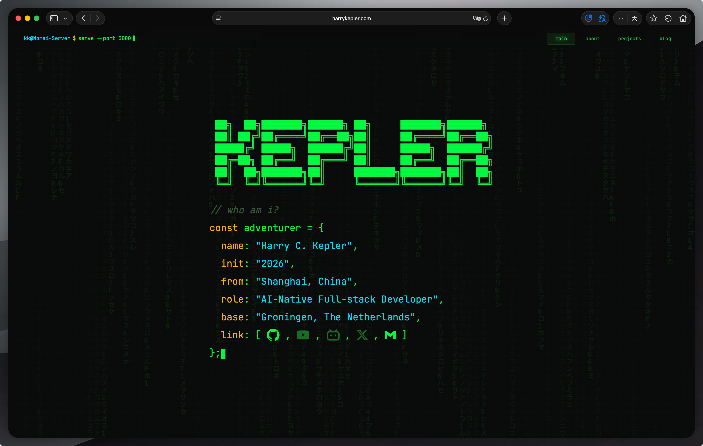
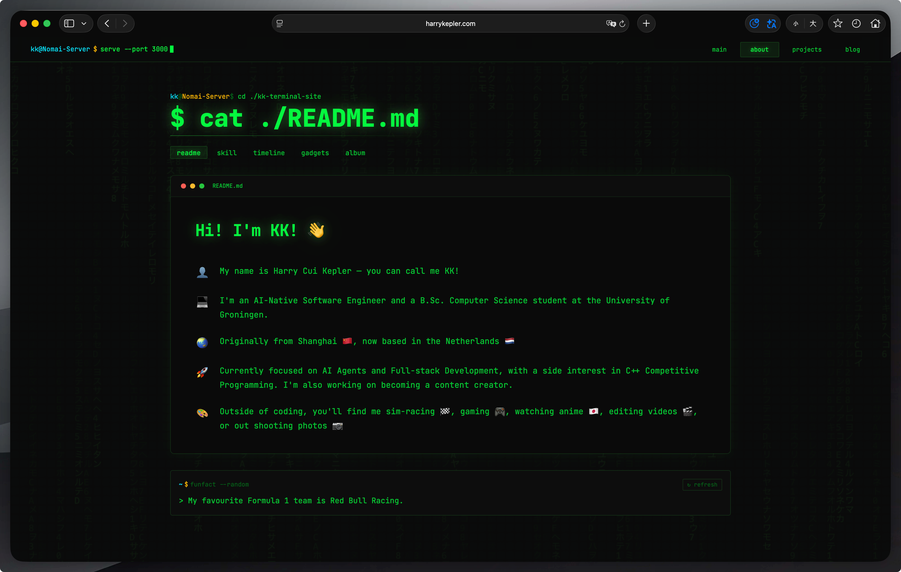
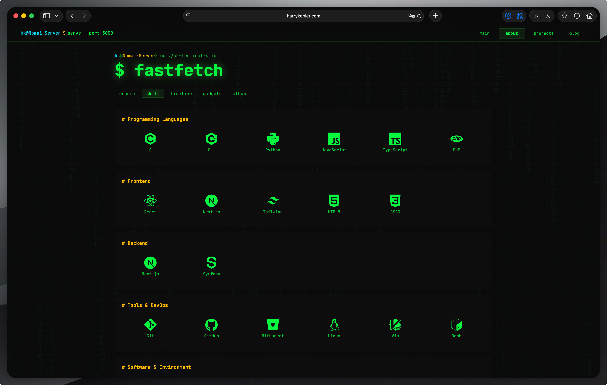
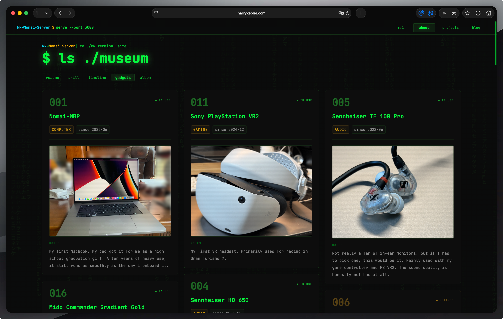
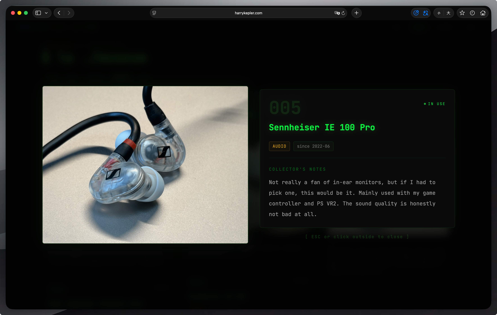
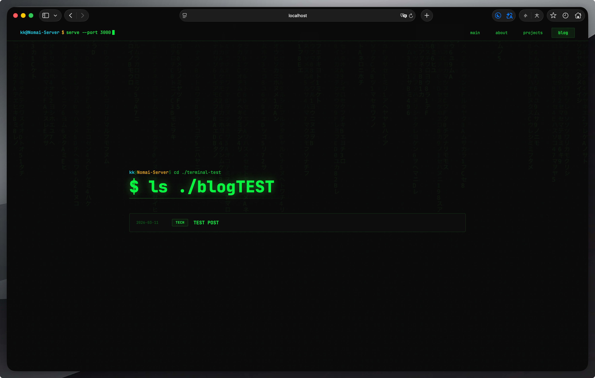
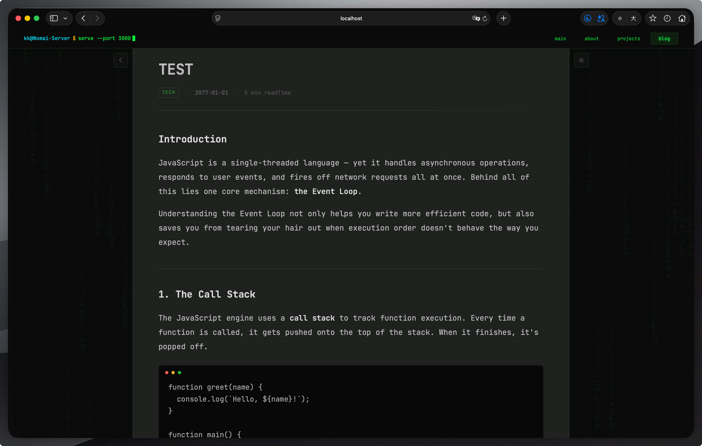
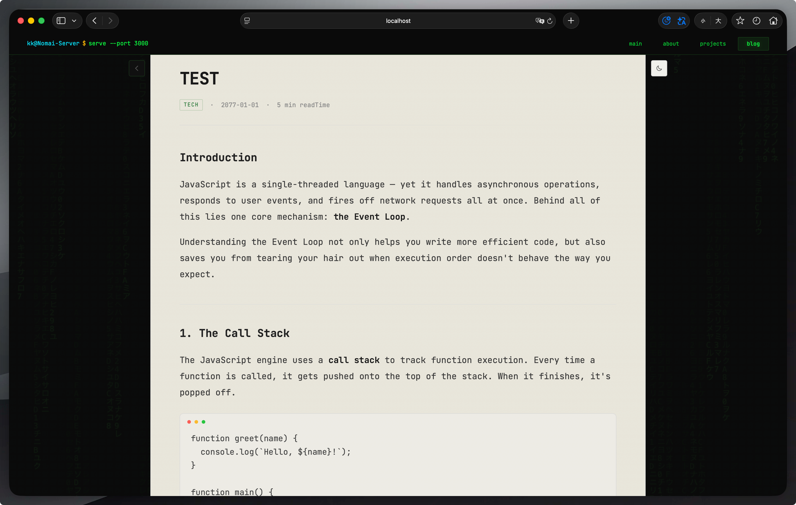
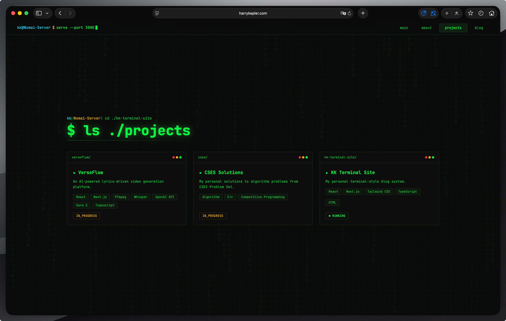

# KK Terminal Website

A terminal-themed personal website built from scratch with **Next.js 14**, **React 18**, **TypeScript**, and **Tailwind CSS**. Every visual element — from the CRT scanlines to the Matrix rain background — delivers an immersive retro-terminal experience on a modern web stack.

**Live site: [harrykepler.com](https://harrykepler.com)**

> **This repository is a source code showcase, not a template.** See [License](#license) below.



---

## Pages Preview

### Home

ASCII art hero section with a code-block-styled self-introduction and social links, set against the Matrix digital rain.


### About

README-style bio card with a randomized fun-fact terminal widget.



### Skills

Categorized tech stack grid with icons.



### Album

Masonry photo gallery with click-to-zoom lightbox.


### Gadgets

Gear/device collection with museum-exhibit-style modal. Dual-themed: green for active, amber for retired.




### Blog

Blog index with category-colored entries, and full Markdown article rendering with a one-click dark/light mode toggle.





### Projects

Project cards with status indicators, tech tags, and hover effects.



---

## Design Philosophy

The entire site is designed as if the visitor is interacting with a CRT terminal. Key design decisions include:

- **Monospace-first typography** — JetBrains Mono is loaded via `next/font` and applied globally.
- **Terminal color palette** — A custom green-on-black scheme (`#00ff41` on `#0a0a0a`) with amber, cyan, and red accents defined in the Tailwind config.
- **CRT scanline overlay** — A fixed CSS pseudo-element that draws faint horizontal lines across the entire viewport, simulating a cathode-ray tube display.
- **Matrix digital rain** — A full-viewport Canvas animation rendering falling Katakana and hex characters, with per-route opacity control.
- **Code-block aesthetics** — Page titles render as shell prompts (`kk@Nomai-Server $`), the navbar features a typewriter animation, and content cards mimic terminal windows with red/yellow/green dot headers.

---

## Tech Stack

| Layer | Technology |
|-------|------------|
| Framework | Next.js 14 (App Router, Static Export) |
| Language | TypeScript (strict mode) |
| UI Library | React 18 |
| Styling | Tailwind CSS 3.4 + custom CSS |
| Font | JetBrains Mono (Google Fonts via `next/font`) |
| Markdown | gray-matter + react-markdown + remark-gfm |
| Icons | react-icons (Simple Icons, VS Code Icons, Tabler) |
| Build | Static site generation via `output: 'export'` |

---

## Project Structure

```
app/
├── layout.tsx              Root layout: font, Navbar, MatrixRain, CRT overlay, footer
├── page.tsx                Home: ASCII art hero + code-block self-intro + social links
├── globals.css             Global styles (500+ lines of custom CSS)
├── about/
│   ├── layout.tsx          Shared About layout
│   ├── page.tsx            README-style bio card + random fun-fact widget
│   ├── skill/page.tsx      Categorized skill grid with tech icons
│   ├── timeline/page.tsx   Git-log-style life timeline
│   ├── gadgets/page.tsx    Gear collection with museum-exhibit modal
│   └── album/page.tsx      Masonry photo gallery with lightbox
├── blog/
│   ├── page.tsx            Blog index with category-colored entries
│   └── [slug]/page.tsx     Markdown article renderer with dark/light toggle
└── projects/
    └── page.tsx            Project cards with status indicators

components/
├── MatrixRain.tsx          Canvas-based Matrix rain (25 FPS, responsive)
├── AlbumCard.tsx           Photo card + portal-based lightbox (ESC to close)
├── GadgetCard.tsx          Gear card + full-screen exhibit modal (active/retired theming)
├── BlogArticleToolbar.tsx  Floating toolbar: back button + light/dark mode toggle
├── RevealWrapper.tsx       IntersectionObserver scroll-reveal animation
├── Navbar.tsx              Terminal prompt with typewriter effect + route highlighting
├── CursorBlink.tsx         Blinking terminal cursor
├── TerminalHeader.tsx      Page title styled as a shell command
├── ProjectCard.tsx         Project card with status dot + hover scale
├── BlogEntry.tsx           Blog list entry with category tag styling
├── SkillTable.tsx          Skill category grid
├── SubpageNav.tsx          Tab navigation for About subpages
├── FunFact.tsx             Randomized fun-fact terminal widget
└── TimelineItem.tsx        Timeline node component

lib/
└── markdown.ts             gray-matter wrapper for frontmatter parsing

content/
└── blog/*.md               Markdown blog posts with YAML frontmatter
```

---

## Feature Highlights

### Visual Effects
- **CRT scanline overlay** — Pure CSS repeating gradient, fixed position, pointer-events disabled.
- **Matrix rain** — Canvas-rendered falling characters (Katakana + hex), frame-rate capped at 25 FPS for performance. Opacity varies by route (higher on home page, subtle elsewhere).
- **Terminal glow** — Multiple levels of `text-shadow` and `box-shadow` utilities (`text-glow`, `text-glow-sm`, `box-glow`) for authentic phosphor glow.
- **Scroll reveal** — Components fade in with `translateY` when entering the viewport via `IntersectionObserver`.

### Components
- **Navbar** — Fixed terminal prompt bar with a typewriter animation that types out `serve --port 3000` on load. Navigation links use bracket hover effects (`[main]`).
- **Album lightbox** — Click a photo card to open a portal-rendered modal with backdrop blur, zoom-in animation, and ESC/click-outside dismissal. Body scroll is locked while open.
- **Gadget exhibit** — Dual-themed cards (green for active, amber for retired) with a museum-style full-screen modal featuring split image/info layout.
- **Blog article** — Full Markdown rendering with a carefully styled `.prose-article` class covering headings, code blocks (with macOS window dots), blockquotes, tables, lists, images, and `<details>` elements. Includes a one-click light mode toggle that swaps the entire article palette via CSS class scoping (`html.blog-light`).
- **Fun Fact widget** — Terminal-style command output (`$ funfact --random`) with a refresh button that guarantees a different fact each click.

### Architecture
- **Static export** — `output: 'export'` in `next.config.js` produces a fully static site deployable to any CDN or GitHub Pages.
- **App Router** — Uses Next.js 14 App Router with nested layouts (root layout + About layout).
- **Dynamic blog routing** — `[slug]/page.tsx` with `generateStaticParams` reads Markdown files from `content/blog/` at build time.
- **Bilingual reading time** — The blog page estimates read time accounting for both CJK characters (400 chars/min) and English words (200 words/min).
- **No external runtime dependencies** — No database, no CMS, no API calls. Everything is self-contained.

---

## Running Locally

> **Note:** This is published as a showcase. The source contains placeholder content (test data, dummy images). 

```bash
# Install dependencies
npm install

# Start dev server
npm run dev

# Build static site
npm run build
```

---

## Disclaimer

This repository exists to demonstrate web design and frontend engineering skills. The source code is published for **viewing and learning purposes only**.

- This is **not** a template, starter kit, or boilerplate.
- Please **do not** clone this repo and replace the content with your own to create a derivative website.
- You are welcome to study the code, reference specific techniques, and learn from the implementation.

---

## License

This project is licensed under [CC BY-NC-ND 4.0](https://creativecommons.org/licenses/by-nc-nd/4.0/).

You may share the original material with attribution, but you may **not** use it commercially or distribute modified versions.
